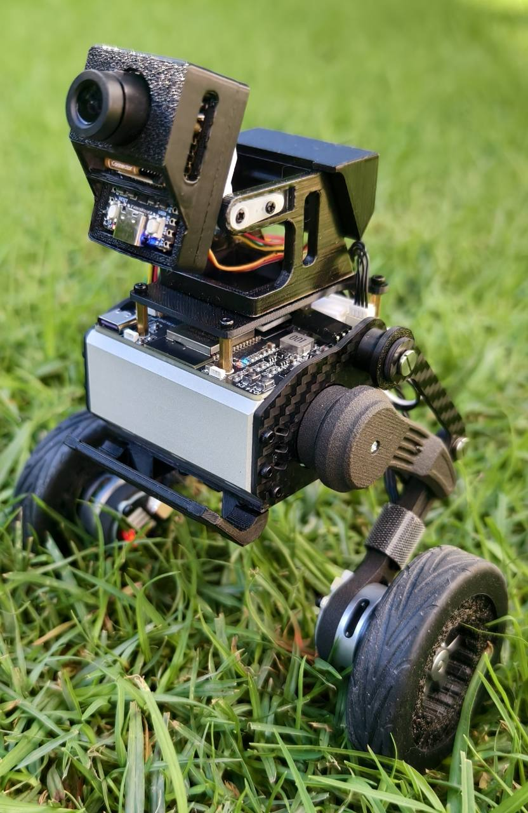

# WRobot - sdevil Enhanced

**AI 增强型自平衡轮足机器人**

中文 | [English](README.md)



WRobot - sdevil Enhanced 是一个基于 ESP32 的轮足机器人平台，用于研究自平衡运动、
腿部动作、嵌入式视觉以及未来的 AI Agent 控制。ESP32 始终负责实时运动与安全控制，
MaixCam 或其他 AI 模块负责感知，并向 ESP32 发送高级命令。

> [!WARNING]
> 本项目属于实验性机器人。测试新固件时应架空轮子，并确保可以随时物理断电。
> WiFi、视觉和 AI 命令都不得绕过 ESP32 的运动安全层直接控制电机。

## 当前功能

- ESP32-WROOM-32 实时运动主控
- 基于 SimpleFOC 的双无刷轮电机控制
- 基于 MPU6050 的 LQR 平衡与偏航控制
- 两个 STS3032 智能总线舵机控制腿部
- Gamepad 蓝牙手柄控制
- 坐下、起立、稳定的多方向跳跃与越障
- MaixCam 人脸、动物、乒乓球类别化追踪、UART 目标偏差与 MJPEG 网页视频
- 带 WebSocket、松手立即停止、1 秒丢失命令安全超时、mDNS 与 captive portal 的网页控制
- 摄像头俯仰和前挡机构 PWM 舵机控制
- RGB 与电池电压状态处理

## 系统架构

```text
MaixCam / 未来 AI 模块 / 网页 / Gamepad 手柄
                    |
              高级命令与意图
                    v
              ESP32 运动主控
          平衡、安全、腿部、轮部控制
                    |
       +------------+-------------+
       |            |             |
   无刷轮电机   STS3032 腿舵机   PWM 附件舵机
```

AI 或视觉模块不直接驱动电机。控制权和数据流详见
[系统架构](docs/ARCHITECTURE.zh-CN.md)。

## 仓库目录

| 目录 | 用途 |
| --- | --- |
| `robot-code/` | 机器人运动和网页控制的 ESP32 PlatformIO 主固件 |
| `maixcam-code/` | MaixCam 视觉应用及 UART 命令输出 |
| `servo-code/` | 配置 STS3032 时临时烧录的 ESP32 串口桥固件 |
| `web-ui-react/` | 嵌入式控制页面的 React/TypeScript 源码 |
| `docs/` | 中英文项目文档 |

## 快速开始

### 编译机器人固件

```powershell
cd robot-code
pio run
```

只有在机器人被可靠固定后才执行烧录：

```powershell
pio run -t upload
```

> [!IMPORTANT]
> USB 刷写 `robot-code` 主体固件前，必须先断开 **MaixCam 与主板 `TX/RX` UART** 的连接。
> 实测如果摄像头 UART 仍然挂在主板串口上，ESP32 下载模式会受到干扰，可能出现
> `Serial data stream stopped`、`Failed to write to target RAM` 等上传失败问题。
>
> 当前规则：
> - **USB 刷主体固件前：断开 camera UART**
> - **刷完主体固件后：再接回 camera UART**
> - **MaixCam 自身固件更新：不受此规则影响**

### 使用网页控制

烧录当前机器人固件后：

```text
WiFi 名称: sdevil-WRobot
密码:      wrobot123
网址:      http://192.168.8.1
本地域名:  http://wrobot.local
```

详细操作和 API 见[网页控制文档](docs/WEB_CONTROL.zh-CN.md)。

### 通过 OTA 更新固件

机器人主板可以直接通过 Web UI 更新固件：

1. 编译生成 `robot-code/.pio/build/esp32dev/wrobot_firmware_<版本号>.bin`
   （例如 `wrobot_firmware_3.2.51.bin`）。
2. 打开机器人 Web UI，进入**设置**。
3. 进入**维护模式**。
4. 确认机器人已经坐下，并处于停机状态。
5. 确认电量不低于 `30%`；如果机器人正在通过 USB 供电，可以启用 USB 供电确认。
6. 在**高级维护**中选择生成的 `wrobot_firmware_<版本号>.bin` 并上传。
7. 保持页面打开，等待机器人重启，并确认 Web UI 显示新的固件版本。

OTA 会写入 ESP32 的非当前运行应用分区。如果上传中断或上传过程中断电，原先可启动固件仍会保留。
如果 OTA 无法访问，仍然可以通过 USB 重新刷写主板固件恢复。

检测器辅助追逐、预测和重新捕获设计见[预测追踪架构](docs/TRACKING_ARCHITECTURE.zh-CN.md)。
摄像头网络出口和局域网访问边界见[摄像头隐私审计](docs/CAMERA_PRIVACY.zh-CN.md)。

Flash 使用、分区选择和优化规则见[Flash 与内存预算](docs/FLASH_BUDGET.zh-CN.md)。
目录职责和生成文件规则见[项目结构](docs/PROJECT_STRUCTURE.zh-CN.md)。
调试过程中验证过的硬件稳定性经验见[工程经验记录](docs/ENGINEERING_NOTES.zh-CN.md)。修改 LED、OTA、Web 控制、摄像头预览或运动核心集成前应先阅读。

## 开发路线

- V1：视觉追踪和稳定的手机网页控制
- V2：语音命令与表情屏
- V3：外部 AI Agent 和 LLM 命令接入
- V4：扩展轮足动作与自主能力

## 项目来源与致谢

本项目基于以下公开分享的原始设计发展而来：

1. [MuShibo/Micro-Wheeled_leg-Robot](https://github.com/MuShibo/Micro-Wheeled_leg-Robot)：
   穆世博的原始轮足机器人项目，其 README 将李育锋列为贡献者。

当前项目由 **sdevil** 维护。完整署名和来源记录见
[致谢](ACKNOWLEDGEMENTS.md)与[来源声明](NOTICE.md)。

## 许可证状态

本项目目前尚未选定统一许可证。当前项目代码、目录组织、Web UI、MaixCam 集成、
OTA/设置系统和运动控制集成由 **sdevil** 维护。

仓库内第三方库继续遵循各自目录中的许可证文件，分发前请阅读 [NOTICE](NOTICE.md)。
